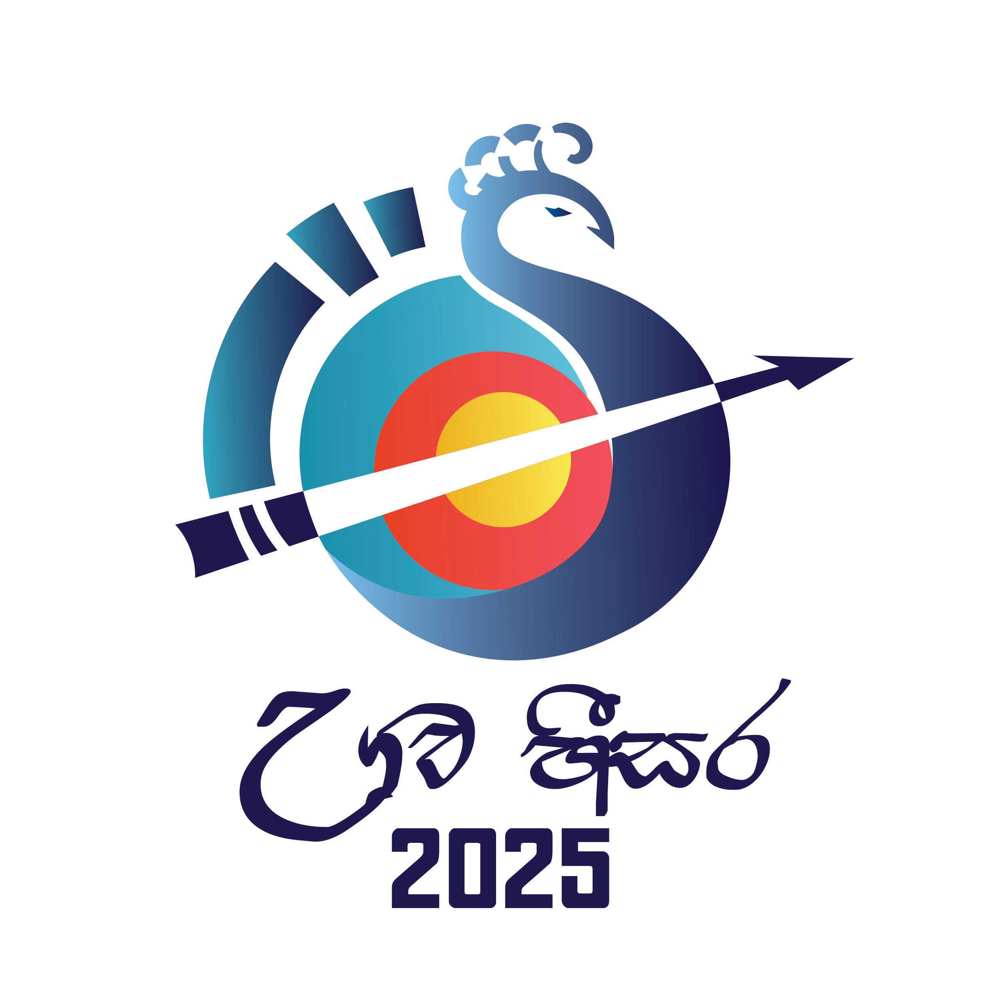

# UVA HEESARA Open Archery Championship - Entries Dashboard

A modern, responsive dashboard application for managing and viewing participant entries for the UVA HEESARA Open Archery Championship 2025.



## 🚀 Quick Deployment to GitHub Pages

This dashboard is now configured with security measures to protect API endpoints. 

### 1. Configure GitHub Secrets
Go to your repository → Settings → Secrets and variables → Actions

Add these secrets:
- **VITE_API_BASE_URL**: Your Google Apps Script web app URL
- **VITE_ALLOWED_ORIGINS**: Your custom domain (e.g., `https://uvaheesara.uvaarchery.lk`)

### 2. Enable GitHub Pages
- Go to Repository → Settings → Pages  
- Source: "GitHub Actions"

### 3. Push to main branch
The GitHub Action will automatically build and deploy securely.

## 🔒 Security Features

✅ **Environment Variables**: API endpoints stored securely  
✅ **Origin Validation**: Only approved domains can access the API  
✅ **Rate Limiting**: Prevents API abuse (10 requests/minute)  
✅ **Request Obfuscation**: Makes API calls less obvious  
✅ **Production Hardening**: Removes debug info and source maps  

📖 **Full Security Guide**: See `SECURITY.md` for detailed configuration

## Features

### 📊 **Dashboard Overview**
- **Real-time Statistics**: Total participants, gender distribution, events, and clubs
- **Interactive Charts**: Visual representation of data with pie charts and bar graphs
- **Responsive Design**: Works seamlessly on desktop, tablet, and mobile devices

### 📋 **Participant Management**
- **Comprehensive Table**: View all participants with detailed information
- **Advanced Filtering**: Filter by gender, event, club, or search by name
- **Sorting**: Sort by any column (name, age, club, event, etc.)
- **Pagination**: Efficient browsing of large participant lists

### 📁 **Data Management**
- **CSV Upload**: Easy file upload for updating participant data
- **Data Processing**: Automatic parsing and validation of CSV files
- **Export Functionality**: Download processed data
- **Error Handling**: Comprehensive error messages and validation

### 🎨 **User Experience**
- **Professional UI**: Modern design with tournament branding
- **Loading States**: Smooth preloaders and progress indicators
- **Accessibility**: WCAG compliant design patterns
- **Performance**: Optimized rendering and data handling

## Technology Stack

### Frontend Framework
- **React 18** with TypeScript for type safety
- **Vite** for fast development and optimized builds
- **React Query (TanStack Query)** for data management and caching

### UI & Styling
- **Tailwind CSS** for utility-first styling
- **Lucide React** for consistent iconography
- **Custom Design System** with tournament-specific colors

### Data Visualization
- **Recharts** for interactive charts and graphs
- **Responsive Charts** that adapt to screen sizes

### Data Processing
- **Papa Parse** for CSV file processing
- **Custom Data Transformers** for entry validation and statistics

## Getting Started

### Prerequisites
- Node.js 20.19.0+ (recommended)
- npm 10+

### Installation

1. **Install dependencies**
   ```bash
   npm install
   ```

2. **Start development server**
   ```bash
   npm run dev
   ```

3. **Open in browser**
   ```
   http://localhost:5174
   ```

### Available Scripts

- `npm run dev` - Start development server
- `npm run build` - Build for production
- `npm run preview` - Preview production build

## Data Format

The application expects CSV files with the following columns:

| Column | Description | Required |
|--------|-------------|----------|
| Name | Participant's full name | ✅ |
| DOB | Date of birth (DD/MM/YYYY, DD.MM.YYYY, or YYYY-MM-DD) | ✅ |
| Gender | Male or Female | ✅ |
| Contact | Phone number or contact information | ✅ |
| Club | Club or organization name | ✅ |
| Event | Primary event category | ✅ |
| Bow Sharing | Bow sharing information | ❌ |
| extra event | Additional event participation | ❌ |

### Example CSV Row
```csv
Name,DOB,Gender,Contact,Club,Bow Sharing,Event,extra event
John Doe,15/03/1995,Male,0771234567,Colombo Archery Club,,Recurve Open 70 Men,60m Cadet
```

## Features in Detail

### Statistics Dashboard
- **Participant Count**: Total registered participants
- **Gender Distribution**: Male vs Female breakdown
- **Event Categories**: Number of different events
- **Club Participation**: Number of participating clubs
- **Age Categories**: Automatic categorization (U10, U12, U14, U17, U21, Over 40, Open)

### Data Visualization
- **Gender Distribution Pie Chart**: Visual gender breakdown
- **Age Categories Chart**: Distribution across age groups
- **Top Events Bar Chart**: Most popular events by participation
- **Club Participation Chart**: Leading clubs by member count

### Participant Table Features
- **Search**: Find participants by name or club
- **Filter by Gender**: Male, Female, or All
- **Filter by Event**: Select specific events
- **Sort**: Click column headers to sort
- **Pagination**: Navigate through large datasets

## Project Structure

```
src/
├── components/          # Reusable UI components
│   ├── Charts.tsx      # Data visualization components
│   ├── Header.tsx      # Application header with actions
│   ├── Loading.tsx     # Loading states and preloaders
│   ├── ParticipantsTable.tsx  # Participant data table
│   └── StatisticsCards.tsx    # Stats overview cards
├── types/              # TypeScript type definitions
│   └── index.ts        # Shared interfaces and types
├── utils/              # Utility functions
│   └── dataProcessor.ts # CSV parsing and data transformation
├── App.tsx             # Main application component
├── main.tsx           # Application entry point
└── index.css          # Global styles and Tailwind imports
```

## Deployment

### Build for Production
```bash
npm run build
```

The built files in `dist/` can be deployed to any static hosting service.

---

**UVA HEESARA Open Archery Championship 2025**  
*Professional tournament management made simple*
